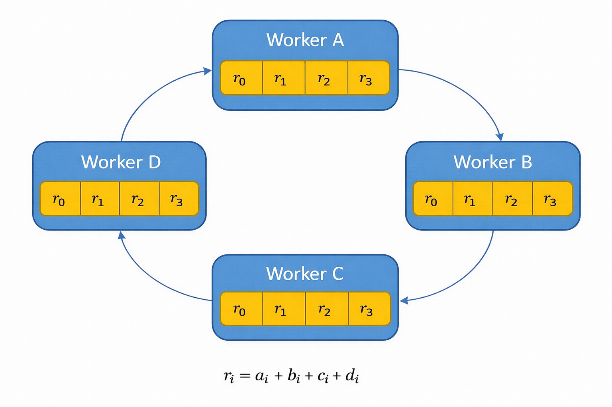

# Distributed Deep Learning Framework

A high-performance, from-scratch distributed deep learning framework implementing neural networks, optimizers, and distributed training without relying on PyTorch or TensorFlow for core logic.

At its heart is a **Fault-Tolerant Ring-AllReduce** backend implemented over TCP/UDP sockets, with GPU acceleration via CuPy and mixed-precision (FP16/FP32) training support.


*[The Ring-AllReduce algorithm](https://medium.com/data-science/visual-intuition-on-ring-allreduce-for-distributed-deep-learning-d1f34b4911da)*

---

## Key Features

* **Custom Neural Network Primitives**
  Implementations of:
  * `Linear`, `ReLU`, `CrossEntropy` (CPU and GPU)
  * `Conv2d` (strided im2col), `MaxPool2d`, `GlobalAvgPool2d`
  * `BatchNorm2d`, `Dropout`, `Flatten`
  * Optimizers: `SGD`, `Adam`, `AdamW`
  * LR Schedulers: `CosineAnnealingLR`, `StepLR`

* **Fault-Tolerant Distributed Training**
  Fully peer-to-peer Ring-AllReduce architecture with:
  * Automatic checkpointing and rollback
  * Heartbeat-based failure detection
  * Gossip protocol for failure propagation
  * Transparent recovery without application changes

* **Hybrid Python / C Networking**
  Performance-critical socket communication is offloaded to a C extension (`fast_net`) to minimize Python overhead.

* **GPU Acceleration**
  CUDA-enabled training via CuPy, supporting both Linear and CNN workloads.

* **Mixed-Precision Training**
  FP16 weights and gradients with FP32 master weights and dynamic loss scaling for numerical stability.

---

## Project Structure

### Core Neural Network Components

| File | Description |
|------|-------------|
| `core/core.py` | CPU-based neural network layers (`Linear`, `ReLU`, `CrossEntropy`), optimizers (`SGD`, `Adam`), and LR schedulers (`CosineAnnealingLR`, `StepLR`) |
| `core/core_gpu.py` | GPU-accelerated layers (`LinearGPU`, `ReLUGPU`), optimizers (`SGD_GPU`, `AdamW_GPU`), and LR schedulers (`CosineAnnealingLR_GPU`, `StepLR_GPU`) |
| `core/core_cnn.py` | CNN layers optimized for GPU (`Conv2d`, `BatchNorm2d`, `MaxPool2d`, `GlobalAvgPool2d`, `Dropout`, `Flatten`) |

---

### Training Applications

| File | Description |
|------|-------------|
| `apps/train_mnist.py` | Distributed MNIST training with Linear models. Supports CPU and GPU backends. |
| `apps/train_cifar.py` | Distributed CIFAR-10 training with CNN architecture (GPU only). Features mixed-precision training with AdamW and cosine annealing LR. |

---

### Communication Libraries

| File | Description |
|------|-------------|
| `comms/allreduce_cpu.py` | CPU Ring-AllReduce implementation for distributed gradient averaging. Pure Python, no GPU required. |
| `comms/allreduce_gpu.py` | Fault-tolerant GPU Ring-AllReduce with automatic checkpointing, failure detection, and recovery. |

---

### Fault Tolerance Infrastructure

| File | Description |
|------|-------------|
| `comms/udp_reliable.py` | Reliable UDP communication layer with acknowledgments and retries |
| `comms/gosip.py` | Gossip protocol for failure and recovery notification propagation |
| `comms/heartbeats.py` | Heartbeat monitoring for neighbor failure detection |

---

### Distributed Infrastructure

| File | Description |
|------|-------------|
| `comms/discovery_server.py` | Rendezvous server for worker discovery and ring formation |
| `comms/fast_sockets.c` | C extension for zero-copy socket transmission of NumPy/CuPy buffers |
| `comms/setup.py` | Build script for the C extension |

---

### Data Utilities

| File | Description |
|------|-------------|
| `datasets/download_cifar.py` | CIFAR-10 download and preprocessing |
| `datasets/load_cifar.py` | CIFAR-10 data loading utilities |
| `datasets/load_data.py` | MNIST loading (via scikit-learn) |

---

## Installation and Setup

### 1. Prerequisites

* Python 3.8+
* CUDA-enabled GPU (recommended for GPU backend)

Install dependencies:

```bash
pip install numpy cupy-cuda12x matplotlib scikit-learn
```

Replace `cupy-cuda12x` with the version matching your CUDA installation (e.g., `cupy-cuda11x`).

---

### 2. Compile the C Extension (Optional but Recommended)

The communication backend can use an optimized C module:

```bash
python3 comms/setup.py build_ext --inplace
```

This generates a shared object such as:

```
fast_net.cpython-3x-x86_64-linux-gnu.so
```

---

### 3. Prepare Datasets

**CIFAR-10:**
```bash
python3 datasets/download_cifar.py
```

**MNIST:**
```bash
python3 datasets/load_data.py
```

MNIST downloads automatically, but running once caches the data locally.

---

## How to Run

The system requires **one discovery server** and **N workers**.

### Step 1: Start the Discovery Server

```bash
python3 comms/discovery_server.py
```

Keep this running in a separate terminal.

---

### Step 2: Start Workers

Workers can run on the same machine (for testing) or across multiple machines.

---

## Training Examples

### MNIST Training (CPU Backend)

```bash
# Terminal 1 - Discovery server
python3 comms/discovery_server.py

# Terminal 2 - Worker 0
python3 apps/train_mnist.py 0 2 256 128 0.5 --backend cpu --epochs 3

# Terminal 3 - Worker 1
python3 apps/train_mnist.py 1 2 256 128 0.5 --backend cpu --epochs 3
```

**Arguments:**
- `rank`: Node rank (0 to world_size-1)
- `world_size`: Total number of nodes
- `batch_size`: Batch size per node
- `hidden_size`: Hidden layer size
- `lr`: Learning rate
- `--backend`: `cpu` or `gpu`
- `--epochs`: Number of epochs

---

### MNIST Training (GPU Backend with Fault Tolerance)

```bash
# Terminal 1
python3 apps/train_mnist.py 0 2 2048 128 0.5 --backend gpu --epochs 3

# Terminal 2
python3 apps/train_mnist.py 1 2 2048 128 0.5 --backend gpu --epochs 3
```

---

### CIFAR-10 CNN Training (GPU only)

```bash
# Terminal 1 - Worker 0
python3 apps/train_cifar.py 0 2 128 256 0.001 10 --checkpoint_interval 50

# Terminal 2 - Worker 1
python3 apps/train_cifar.py 1 2 128 256 0.001 10 --checkpoint_interval 50
```

**Arguments:**
- `rank`: Node rank
- `world_size`: Total number of nodes
- `batch_size`: Batch size per node
- `hidden_size`: Fully connected hidden layer size
- `lr`: Learning rate
- `epochs`: Number of epochs
- `--checkpoint_interval`: Iterations between checkpoints (default: 50)

---

## Technical Details

### Ring-AllReduce Algorithm

The synchronization proceeds in two phases:

1. **Scatter-Reduce**
   * Gradients are split into N chunks (N = number of workers)
   * Each worker sends and accumulates chunks from its neighbor
   * After N-1 steps, each worker owns one fully reduced chunk

2. **All-Gather**
   * Reduced chunks are circulated again
   * After N-1 steps, all workers reconstruct the full averaged gradient

---

### Fault Tolerance Architecture

The fault-tolerant ring allreduce implements:

* **Checkpointing:** Periodic model state saves via callbacks
* **Heartbeat Monitoring:** Detects neighbor failures via UDP heartbeats
* **Gossip Protocol:** Propagates failure/recovery notifications to all nodes
* **Automatic Recovery:**
  1. Failure detected via heartbeat timeout
  2. Gossip notifies all nodes to stop
  3. All nodes rollback to last checkpoint
  4. TCP ring reconnected with updated topology
  5. Training resumes from checkpoint iteration

Recovery is transparent to the application - the `allreduce()` call returns recovery info that the training loop uses to adjust iteration counters.

---

### Networking Optimization

The `fast_net` C module:
* Accepts raw NumPy/CuPy buffers
* Performs direct send/recv operations
* Releases the Python GIL for concurrent I/O
* Avoids Python-level loops and buffer concatenation

---

### Mixed-Precision Strategy (train_cifar.py)

* **Storage:** FP16 weights and activations
* **Master Weights:** FP32 copy for optimizer updates
* **Loss Scaling:**
  * Initial scale: 2^16
  * Halved on NaN/Inf detection
  * Doubled after 2000 stable iterations

This balances speed, memory efficiency, and numerical stability.

---

## API Reference

### RingAllReducer (CPU)

```python
from comms.allreduce_cpu import RingAllReducer

comm = RingAllReducer(rank=0, world_size=2, verbose=True)
averaged_grads = comm.allreduce([grad1, grad2, grad3])
comm.close()
```

### FaultTolerantRingAllReducer (GPU)

```python
from comms.allreduce_gpu import FaultTolerantRingAllReducer

def get_model_state():
    return {'weights': model.weights.get(), 'biases': model.biases.get()}

def set_model_state(state):
    model.weights[:] = cp.asarray(state['weights'])
    model.biases[:] = cp.asarray(state['biases'])

comm = FaultTolerantRingAllReducer(
    rank=0,
    world_size=2,
    get_model_state_fn=get_model_state,
    set_model_state_fn=set_model_state,
    checkpoint_interval=100,
    verbose=True
)

# During training loop:
averaged_grads, info = comm.allreduce([grad1, grad2, grad3])
if info['recovered']:
    # Handle recovery - resume from info['resume_iteration']
    pass

comm.close()
```

---

## Summary

This project demonstrates how modern distributed deep learning systems can be built from first principles, combining:

* Custom autograd-free neural networks
* Efficient GPU computation
* Low-level networking with C extensions
* Decentralized synchronization algorithms
* Fault tolerance with checkpointing and recovery

Ideal for learning, research, and systems-level experimentation in distributed ML.
